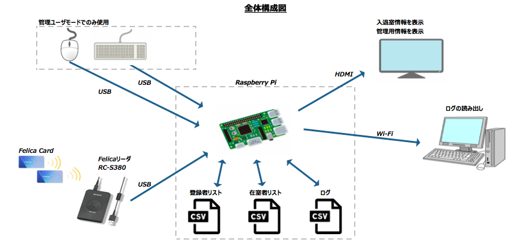
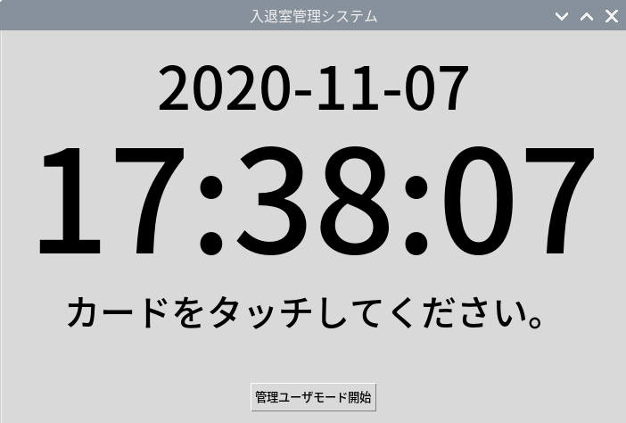

# 概要  
Felicaを用いた入退室管理システムを構築します。  
入室と退室の時刻をログファイルとして記録します。  
GUIはtkinterを使用しています。  

# 環境
* Raspberry Pi 4 Computer Model B  
* Python3.9  
* Sony PaSoRi RC-S380    

# 全体構成図

# 画面イメージ
## 通常ユーザモード

## 管理ユーザモード

